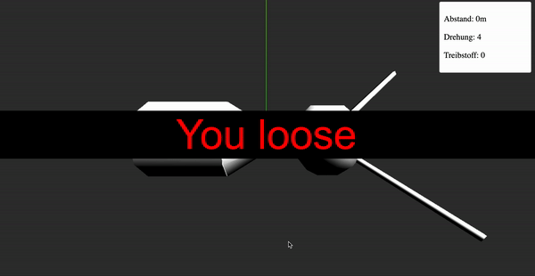

# Rendezvous - A space game.

Ein Weltraumspiel: http://codekulturbonn.de/rendezvous/



Kannst du mit den Steuerdüsen die Drehung anpassen, bevor der Treibstoff aufgebraucht ist? Steuerdüsen mit <- und ->.

Nutzt [ThreeJS](https://threejs.org/).

## Entwickeln

````bash
yarn
yarn start
#oder:
yarn build
````
