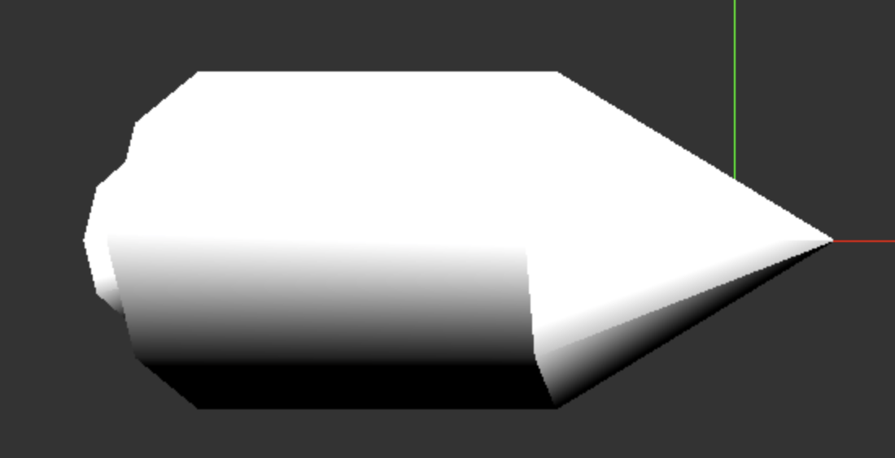

# Rendezvous - A space game.

Nutzt [ThreeJS](https://threejs.org/).



Ein Weltraumspiel: http://codekulturbonn.de/rendezvous/

Kannst du mit den Steuerdüsen die Drehung anpassen, bevor der Treibstoff aufgebraucht ist? Steuerdüsen mit <- und ->.

## Entwickeln

````bash
yarn
yarn start
#oder:
yarn build
````
